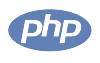

<h1 align="center" >
👋 𝙷𝚎𝚕𝚕𝚘! 𝙸'𝚖 Yaroslav!
</h1>

<h3 align="center">Developer on Python</h3>

---

### About me

I am 24 years old. I am programming in Python, and it's my passion.

- 🌱 I’m currently learning: Go language
- ⚡ Fun fact: I really sleep at night

### :hammer_and_wrench: Languages and Tools :

 

---

### 📫 How to reach me:

[//]: # ([![codewars]&#40;https://www.codewars.com/users/mangoodd/badges/small&#41;]&#40;https://www.codewars.com/users/mangoodd&#41;)

    

